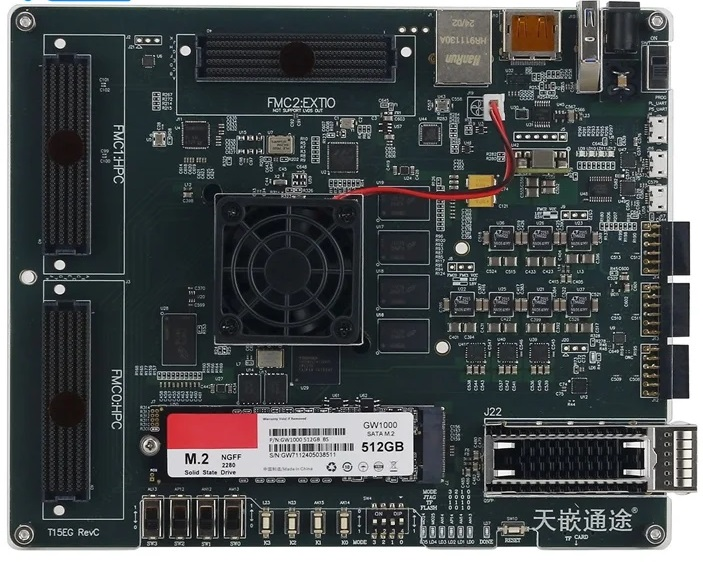

# Awesome TQ15EGMP board

**Use TQ15EGMP board as a general Zynq development board**

TQ15EGMP board is an FPGA-accelerated embedded AI computing board.

The board is based on Xilinx Zynq Ultrascale+ XCZU15EG MPSoC wich also has the following peripherals:

- 4GB DDR4 RAM PS
- 512MB DDR4 RAM PL
- 32GB eMMC Flash
- 64Mb QSPI Flash
- 512G M.2 SATA SSD
- 8KB IIC EEPROM 
- 1000Mbps Ethernet
- TF-card slot
- USB Hub (1 x USB 3.0, 1 x USB 2.0)
- Mini DisplayPort (miniDP)
- USB UART
- 2 x FMC-HPC
- 1 x FMC-LPC
- 2 x  PMOD PL 
- 1 x  PMOD PS 
- QSFP 40 Gb/s

This repository contains materials that help us use TQ15EGMP board as a general Ultrascale+ Zynq development board.

## Documents

Here are some documents you may need, and you can find them in the `./docs` folder. It should be noted that most of them are in Chinese, and currently do not have an English translation.

### Vivado board files

They are in `./board_files`. Please read [its inside README](./board_files/README.md) for more details.

## License

Except for those already noted in the text, other documents written by myself are released under the [CC-BY 4.0](https://creativecommons.org/licenses/by/4.0/) and the code is released under the [MIT](./LICENSE) license.

This repository is created and maintained by me personally.

## Contributors

Thank them for their contributions.
